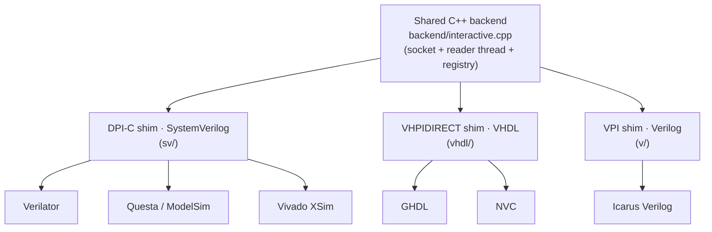

# interactive-sim (DPI/VPI/VHPI)

Drop **viewer-driven controls** and **design-driven flags** anywhere in an HDL
design, at any level of the hierarchy and unconnected to each other, and funnel
them all to and from a **single dedicated viewer over one TCP socket**. Each
component is completely asynchronous to the others.

One simulator-agnostic C++ backend drives **every major HDL simulator**, across
SystemVerilog, Verilog, and VHDL, on Linux, macOS, and Windows, through three
thin foreign-interface shims (DPI / VPI / VHPIDIRECT). Same layering as
[vga-monitor-sim](../vga-monitor-sim).

| Component | Direction | Models | HDL trigger |
|-----------|-----------|--------|-------------|
| `interactive_ctrl` | viewer to design | buttons, switches, toggles | none (self-paced `POLL_US` timer, default 1 ms) |
| `interactive_flag` | design to viewer | LEDs, 7-segments, status words | on `value` change |

## Compatibility

The same simulator-agnostic backend
([backend/interactive.cpp](backend/interactive.cpp)) reaches every simulator
through three thin foreign-interface shims, one per HDL:



| Simulator | HDL | Interface | Linux | macOS | Windows |
| --- | --- | --- | :-: | :-: | :-: |
| Verilator | SystemVerilog | DPI-C | ✅ | ✅ | ✅ MinGW |
| Questa / ModelSim | SystemVerilog | DPI-C | ▫ | n/a | ✅ MinGW |
| Vivado XSim | SystemVerilog | DPI-C | ▫ | n/a | ✅ MinGW |
| GHDL | VHDL | VHPIDIRECT | ✅ | ✅ | ✅ MinGW |
| NVC | VHDL | VHPIDIRECT | ✅ | ✅ | ✅ MinGW |
| Icarus Verilog | Verilog | VPI | ✅ | ✅ | ✅ MinGW |

✅ = exercised end-to-end in CI (the FOSS simulators), from source and against
the prebuilt artifacts. The commercial simulators have no CI runners, so they are
validated manually: ✅ MinGW = checked against Questa FSE and Vivado XSim 2024.1
using the `windows-x86_64-mingw` bundle; ▫ = expected to work via the Linux DPI
`.so` but not routinely checked. GHDL on Windows works with both its **LLVM**
backend (links the library) and its **mcode** backend (loads it via the
`_mcode` wrapper).

## How unconnected components share one socket

The backend (`backend/interactive.cpp`) is compiled once and linked into the
simulation process, so its **process-global singleton** (one socket, one
background reader thread, one registry) is shared by every instance regardless of
where it sits in the hierarchy. That shared singleton, **not any HDL wiring**, is
what lets unrelated components meet on one socket.

- **Outputs** (`flag`): on each `value` change the HDL calls the backend, which
  sends a framed message to the viewer.
- **Inputs** (`ctrl`): a single **background reader thread** owns the receive
  side of the socket and demultiplexes inbound messages into a `name -> value`
  map. Each `ctrl` reads its latest value from that map on its own `POLL_US`
  tick. A value set in the viewer is therefore visible to every clock domain on
  its next sample, with **no coupling between domains**.

> Why `ctrl` has no clock: DPI/VPI give a foreign thread no portable way to force
> a signal value into the simulator asynchronously, since the simulator owns all
> signal scheduling. So `ctrl` self-paces on its own internal `#`-delay timer,
> which keeps it asynchronous to everything else and controls input latency.

## Identity

Each component is identified by a **user-supplied `NAME`**, which is both its
channel id on the wire and its label in the viewer. **Names must be unique**
across the whole simulation; a collision is reported and the duplicate instance
is dropped.

## Wire protocol

Newline-delimited JSON, one message per line. Every sim → viewer message carries
`t`, the simulation time in µs:

```
sim    -> viewer   {"ev":"reg",  "t":1234.567,"name":"btn_run","kind":"ctrl","width":1}
                   {"ev":"flag", "t":1234.567,"name":"led_count","val":42}
                   {"ev":"time", "t":1234.567}
                   {"ev":"close","t":1234.567,"name":"btn_run"}
viewer -> sim      {"name":"btn_run","val":1}
```

Plain JSON lines, so any GUI can speak it; the bundled
`viewer/interactive_viewer.py` is just a reference terminal viewer.

**Heartbeat.** `time` is a periodic heartbeat (1 ms of sim time) that lets the
viewer track simulation time even while nothing else changes. Exactly **one**
component runs the timer — the first to start claims the single heartbeat slot, so
the wire cost is one message per tick regardless of how many components the design
has. A flag write at the same instant counts as reporting the time, so coincident
ticks collapse. There is no knob: the period is internal.

**Time and resolution.** This is a human-interaction interface (buttons, LEDs),
so the time base is the **microsecond**: every `t` tag is in µs and
`interactive_ctrl` polls on a µs-scale `POLL_US` period (default 1 ms, well below
human perception). 1 ns precision is still preserved, so for the one place finer
timing matters (a fast-toggled flag dimmed by PWM duty cycle) a viewer can still
reconstruct its perceived brightness from the µs `t` stamps. The HDL components
carry a `1us/1ns` timescale (Verilog/SV) or use `us`/`ns` time literals (VHDL);
nothing in the design is forced to a finer base.

## Update model

Updates are **per-component and change-driven**: only the component that changed
is transmitted, identified by its `NAME`. There is no full-state snapshot and no
broadcast of all components.

- **Controls (viewer to sim):** the viewer sends one message for the control the
  user actually touched; the backend updates only that entry, and each
  `interactive_ctrl` reads only its own `NAME`. Touching one control says nothing
  about any other.
- **Flags (sim to viewer):** each `interactive_flag` is sensitive to its own
  `value`, so it emits only when *that* instance changes, carrying only its own
  `{name, val}`. Other flags stay silent.

Consequences:

- **No redundant sends.** `@(value)` / `process(value)` wake on an actual change
  event, so reassigning the same value emits nothing.
- **Whole-component granularity.** An 8-bit flag that changes one bit sends its
  full 8-bit `val`, but still only for that one component; there is no per-bit
  delta within a component.
- **Traffic scales with activity, not instance count.** A design with 200 idle
  LEDs and one blinking one sends one message per blink, not 200.
- **Late joiners.** The link is order-insensitive: the backend keeps
  (re)connecting, so the viewer can start after the sim and be closed and reopened
  freely. On each (re)connect the backend replays the full state — a `reg` for
  every open component, the last value of every flag, and the current `time` — so
  a freshly opened viewer immediately shows the current board.

## Quick start

Start the viewer first (it listens; the sim connects as a client):

```sh
make viewer                 # listens on 127.0.0.1:7777 by default (PORT=...)
```

In another terminal, run a demo (button gates a counter, surfaced as flags):

```sh
make demo-vpi               # Icarus Verilog
make demo-dpi               # Verilator (built with --timing)
make demo-vhpi              # GHDL
make demo-nvc               # NVC
```

In the viewer, type `btn_run=1` to start the counter and watch `led_count`
update; `btn_run=0` freezes it. The `led_hb` heartbeat blinks independently.

For a graphical example (a photo of the ULX3S board where you click the buttons
with the mouse and watch the LEDs light up at their position) see the
self-contained [`ulx3s_demo/`](ulx3s_demo/) (its own README + Makefile):


## Usage in your own design

Instantiate the components anywhere in your hierarchy, wired only to the signal
each one models:

```systemverilog
interactive_ctrl #(.NAME("sw_mode"), .WIDTH(2)) u_sw  (.value(mode));
interactive_flag #(.NAME("led_err"), .WIDTH(1)) u_err (.value(error));
```
```vhdl
u_sw  : entity work.interactive_ctrl
    generic map (NAME => "sw_mode", WIDTH => 2) port map (value => mode);
u_err : entity work.interactive_flag
    generic map (NAME => "led_err", WIDTH => 1) port map (value => error);
```

Set `INTERACTIVE_STREAM=host:port` for the simulation. If it is unset or the
connect fails, the simulation still runs: flags are dropped and controls read
their default (0).

Add the shims that match your HDL and point your simulator at the prebuilt
library for the interface it speaks. Below, `<dist>` is the directory holding the
[downloaded bundle](#prebuilt-libraries).

### Verilator (DPI)

`interactive_ctrl` uses `#`-delays, so Verilator needs `--timing`:

```sh
verilator --binary --timing -j 0 --top-module my_tb \
    my_tb.sv my_design.sv interactive_ctrl.sv interactive_flag.sv \
    -LDFLAGS "-L<dist> -linteractive_dpi"
LD_LIBRARY_PATH=<dist> INTERACTIVE_STREAM=127.0.0.1:7777 ./obj_dir/my_tb
```

### Questa / ModelSim (DPI)

`-sv_lib` takes the base name without the `lib` prefix or extension. On Windows
use the `windows-x86_64-mingw` bundle (Questa FSE is MinGW-based):

```sh
vlog my_tb.sv my_design.sv interactive_ctrl.sv interactive_flag.sv
INTERACTIVE_STREAM=127.0.0.1:7777 \
    vsim -c my_tb -sv_lib <dist>/interactive_dpi -do "run -all; quit"
```

### Vivado XSim (DPI)

Use the `windows-x86_64-mingw` bundle. `-sv_lib` finds the trampoline
`interactive_dpi.a`; the real `interactive_dpi.dll` is loaded by name at run time
(keep `<dist>` on `PATH`, or set `INTERACTIVE_DLL=/path/to/interactive_dpi.dll`):

```sh
xvlog -sv my_tb.sv my_design.sv interactive_ctrl.sv interactive_flag.sv
xelab my_tb -s sim -sv_root <dist> -sv_lib interactive_dpi
INTERACTIVE_STREAM=127.0.0.1:7777 xsim sim -R     # <dist> on PATH
```

### GHDL (VHPIDIRECT)

LLVM/gcc backend (links the library at elaboration):

```sh
ghdl -a --std=08 interactive_pkg.vhdl interactive_ctrl.vhdl interactive_flag.vhdl my_design.vhdl my_tb.vhdl
ghdl -e --std=08 -Wl,-L<dist> -Wl,-linteractive_vhpi my_tb
LD_LIBRARY_PATH=<dist> INTERACTIVE_STREAM=127.0.0.1:7777 ./my_tb
```

mcode backend (no link step; use the `_mcode` package, which names the library to
load, and put `<dist>` on the loader path):

```sh
ghdl -a --std=08 interactive_pkg_mcode.vhdl interactive_ctrl.vhdl interactive_flag.vhdl my_design.vhdl my_tb.vhdl
LD_LIBRARY_PATH=<dist> INTERACTIVE_STREAM=127.0.0.1:7777 ghdl --elab-run --std=08 my_tb
```

### NVC (VHPIDIRECT)

```sh
nvc --std=2008 -a interactive_pkg.vhdl interactive_ctrl.vhdl interactive_flag.vhdl my_design.vhdl my_tb.vhdl
nvc --std=2008 -e my_tb
INTERACTIVE_STREAM=127.0.0.1:7777 nvc --std=2008 -r my_tb --load <dist>/libinteractive_vhpi.so
```

### Icarus Verilog (VPI)

```sh
iverilog -g2012 -o my_tb.vvp -s my_tb my_tb.v my_design.v interactive_ctrl.v interactive_flag.v
INTERACTIVE_STREAM=127.0.0.1:7777 vvp -M<dist> -m interactive my_tb.vvp
```

## Prebuilt libraries

Each tagged release publishes a per-platform archive of the **portable,
self-contained backend libraries**: no build step and no simulator headers needed
to consume them. Download the bundle for your platform from the
[Releases](../../releases) page (or build it with `make dist && make dist-vpi`).
Platforms: `linux-x86_64`, `linux-arm64`, `macos-arm64`, `macos-x86_64`,
`windows-x86_64` (MSVC ABI, for Questa) and `windows-x86_64-mingw` (MinGW ABI,
for Verilator / GHDL / NVC / Icarus / Vivado XSim). Each bundle contains:

| File | For |
| --- | --- |
| `interactive_dpi.{so,dylib,dll}` | SystemVerilog simulators (DPI-C) |
| `interactive_vhpi.{so,dylib}` / `interactive_vhpi.dll` | VHDL simulators (VHPIDIRECT) |
| `interactive.vpi` (Linux, macOS, MinGW bundles) | Verilog simulators (VPI) |
| `interactive_dpi.a` (MinGW bundle) | Vivado XSim: the trampoline XSim's gcc links |
| `libinteractive_{dpi,vhpi}.dll.a` (MinGW bundle) | import libraries for MinGW-ABI tools that *link* the DLL (Verilator, GHDL); runtime loaders like NVC do not need them |
| `interactive_{ctrl,flag}.{sv,v,vhdl}` + `interactive_pkg.vhdl` | the HDL shims to add to your sources |
| `interactive_pkg_mcode.vhdl` | drop-in VHDL package for mcode-backend GHDL (names the library in its `foreign` strings) |

Tagged releases also attach `interactive-sim-<version>-<platform>.tar.gz`. It
unpacks to a folder whose **filenames are the stable, unversioned names above**;
the version lives in the folder name (and a `VERSION` file), so multiple versions
coexist as sibling folders and upgrading is repointing one path. The prebuilt
libraries carry **no simulator headers**; on Linux/macOS libstdc++/libgcc are
folded in, so the only runtime dependency is libc.

## CI / tests

`make e2e` runs the end-to-end test from source for every installed simulator;
`make e2e-dist DIST=build/dist` runs the same checks against the **prebuilt**
libraries (including the GHDL-mcode load path). For each simulator the demo
connects over TCP to a listener and the test asserts the protocol handshake
(every component announces itself; the heartbeat flag streams values), skipping
any simulator whose tool is not installed. CI
([.github/workflows/](.github/workflows/)) runs both on every push and PR across
Linux x86_64/arm64, macOS, and Windows, and gates each `v*` tag on the same
checks before publishing the release archives.

## Layout

```
backend/interactive.cpp      shared core: socket, reader thread, protocol, registry
sv/interactive_ctrl.sv       DPI-C viewer-driven input    (Verilator/Questa/XSim)
sv/interactive_flag.sv       DPI-C design-driven output
sv/interactive_dpi_xsim.c    Vivado XSim DPI trampoline (kernel32-only)
v/interactive_ctrl.v         VPI viewer-driven input      (Icarus)
v/interactive_flag.v         VPI design-driven output
v/interactive_vpi.cpp        VPI shim
vhdl/interactive_ctrl.vhdl   VHPIDIRECT viewer-driven input (GHDL/NVC)
vhdl/interactive_flag.vhdl   VHPIDIRECT design-driven output
vhdl/interactive_pkg.vhdl    foreign bindings
vhdl/interactive_vhpi.cpp    VHPIDIRECT shim
viewer/interactive_viewer.py reference terminal viewer
examples/tb_demo.{v,sv,vhdl} per-flow demo testbenches
tests/e2e.py                 end-to-end protocol test (source + prebuilt artifacts)
ci/package-release.sh        pack per-platform release archives (CI, v* tags)
.github/workflows/           CI + multi-platform artifact build + release
ulx3s_demo/                  standalone graphical ULX3S board demo (own README + Makefile)
```

## Status

All four foreign-interface flows (DPI/Verilator, VPI/Icarus, and VHPIDIRECT via
both GHDL and NVC) are exercised end-to-end in CI from source and against the
prebuilt artifacts, on Linux (x86_64/arm64), macOS, and Windows. Questa and
Vivado XSim are validated manually (Windows, MinGW bundle).

The VHPIDIRECT shim passes each component's `NAME` as a **bounded**
`string(1 to 255)` (a constrained array, marshaled as a pointer to its first
character) plus its length, not an unconstrained `string`, which GHDL does not
implement for foreign subprograms. See the comments in
`vhdl/interactive_pkg.vhdl`.

## License

Licensed under the MIT License (see [LICENSE](LICENSE)).
